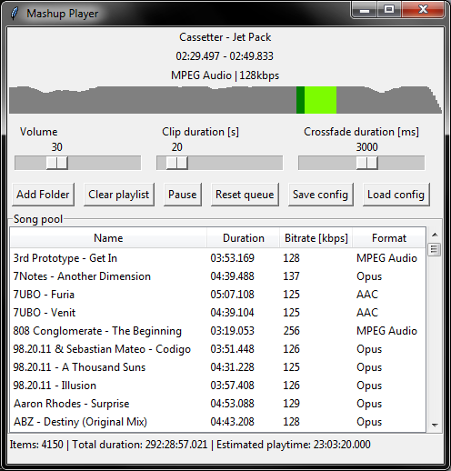

# Mashup Player

## What is this

A music play that plays random songs from the playlist (in a shuffled manner), but only plays a small (~20s) segment from each. The segment is chosen semi-randomly based on the entropy metric, which is used to estimate complexity of a given music segment. Run with `python main.py`.

## Why is this

I made this for personal use because my song library is too large to listen to effectively in a normal way, and I'm a bit ADHD when it comes to background music. There was nothing that already exists that does this.

## Why is this written like shit

Because I don't care and PyGame turned out to be absolute dogshit for anything sound-mixing related. It's an amalgamation of whatever works and whatever approximation/workaround was needed to make it appear to work. Btw. the app will likely crash for you on quit, it's a pygame mixer issue, nothing I can about it, sorry!
